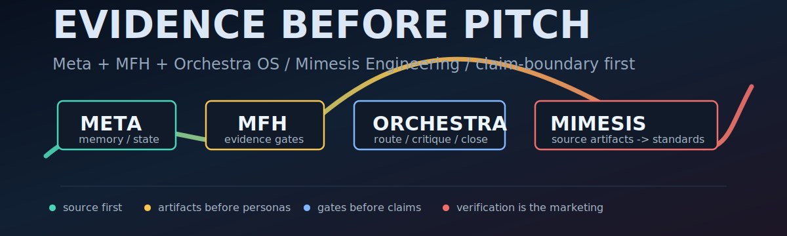

# 오영웅 · @svy04

I build proof-bounded AI operating systems: evidence before pitch. 검증이 곧 마케팅. Not another wrapper.

I build systems that remember, route, critique, and close work with evidence attached. Build the proof surface before the pitch.

source first; artifacts before personas; gates before claims; verification is the marketing.

Metaforge is the headline; OpenClaude is not the headline. Claude and Codex routes belong under the OS, not above it.

## System Stack

- [Metaforge](https://github.com/svy04/metaforge): **Metaforge = Meta + MFH + Orchestra OS**. Meta stores operating memory, MFH gates closure, Orchestra routes agents, and OpenClaude is runtime substrate, not the main thesis. [Public claim evidence map](https://github.com/svy04/metaforge/blob/main/docs/product-quality/public-claim-boundary-report.md#public-claim-evidence-map), [Proof pack](https://github.com/svy04/metaforge/blob/main/docs/marketing/metaforge-public-proof-pack-2026-06-18.md), [2026-06-20 public feedback packet](https://github.com/svy04/metaforge/blob/main/docs/product-quality/public-feedback-snapshot-2026-06-20.md), [MFH goal-trace validation report](https://github.com/svy04/metaforge/blob/main/docs/product-quality/goal-trace-validation-report.md), [secret-scanner evidence](https://github.com/svy04/metaforge/blob/main/docs/product-quality/secret-scanner-evidence-report.md), and [static-analysis remediation queue](https://github.com/svy04/metaforge/blob/main/docs/product-quality/static-analysis-remediation-queue-report.md) bind provenance and gaps. Metaforge hardening is a ratchet, not a release claim: dependency topology, duplicate-shape checks, dead-export triage, public artifact hygiene, public wiring evidence, and session runner export boundary stay bounded. Secret-scanner evidence keeps secret-clean and readiness claims blocked.
- [Mimesis Engineering](https://github.com/svy04/mimesis-engineering): the method layer. Mimesis public v0.1 surface is a Markdown-first, artifact-first AI-native work framework that makes expert process visible through source-first references, cognitive apprenticeship, worked examples, local validators, reference packs, proof-boundary packets, a first-loop demo, a framework manifest, and a source-first reference pack index. [Public Status](https://github.com/svy04/mimesis-engineering/blob/main/STATUS.md), [Proof Boundary](https://github.com/svy04/mimesis-engineering/blob/main/PROOF-BOUNDARY.md), and [Public Claim Pack](https://github.com/svy04/mimesis-engineering/blob/main/docs/PUBLIC-CLAIM-PACK.md) define allowed claims and gaps; public repo evidence, not non-public research proof. fresh verifier output is required before any adoption, benchmark, module-pass, or promotion claim.
- [NoiseProof Agent](https://github.com/svy04/noiseproof-agent): data-agent work with a [Proof packet](https://github.com/svy04/noiseproof-agent/blob/main/docs/review/external-reader-phase-897-current-proof-packet-refresh.md). Not a trading bot; not product-complete; not externally validated.

Current public map, not adoption proof: [metaforge](https://github.com/svy04/metaforge) is the Meta/MFH/Orchestra OS proof surface; [mimesis-engineering](https://github.com/svy04/mimesis-engineering) is the public method surface for reference packs, validators, cases, and proof boundaries, not a hidden canon claim; [noiseproof-agent](https://github.com/svy04/noiseproof-agent) is bounded data-agent work. Older worksheet, case, and infrastructure repos are not the current profile thesis.

Wiring evidence map: runtime import, governance/docs/gates, non-public research boundary, and manual artifact lane.

## Evidence Ledger

Current proof ledger: GitHub profile as an evidence router. Source/CI proof and live public rendering stay separate; live maintenance-hidden is not a proof upgrade.

- [GitHub Profile README Proof Surface](https://svy04.github.io/proof-artifacts/github-profile-readme-proof-surface-2026-06-14/): CI-checked routing and claim-boundary surface.
- [Public GitHub Surface Hygiene Proof Packet](docs/public-github-surface-hygiene-proof-packet.md): Public default-branch scan for scanner-unfriendly placeholders, actual-looking bearer values, and raw auth transcript markers.
- [Render parity proof packet](docs/profile-render-parity-proof-packet.md): source/render/badge consistency.
- [Metaforge Public Claim Evidence Map](https://github.com/svy04/metaforge/blob/main/docs/product-quality/public-claim-boundary-report.md#public-claim-evidence-map): local no-provider map; not external validation.
- [Metaforge MFH Goal Trace Validation](https://github.com/svy04/metaforge/blob/main/docs/product-quality/goal-trace-validation-report.md): representative cross-goal trace pack; validated=2, rejected=1, blocked=1; goal_ids=CG-001,CG-002; local no-provider behavioral governance evidence.
- [Metaforge Secret-Scanner Evidence](https://github.com/svy04/metaforge/blob/main/docs/product-quality/secret-scanner-evidence-report.md): hosted secret scanning and push-protection status plus local scanner availability; not full-history clean proof, security readiness, release readiness, or external validation.
- [Mimesis Visual Failure Packet](https://svy04.github.io/proof-artifacts/mimesis-visual-failure-packet-2026-06-15/): Visual Failure Packet is the current public failure-boundary route. It is a redacted failure artifact and banned-claim boundary showing where Mimesis-style work can become shallow, visually noisy, or overclaimed.
- [Mimesis Minecraft High-Integration Evidence Card](https://svy04.github.io/proof-artifacts/mimesis-minecraft-high-integration-evidence-card-2026-06-15/): source artifact, baseline/conditioned output, gate/scorer, failure cases, claim boundary.
- [Mimesis Minecraft Public Redacted Board v0](https://svy04.github.io/proof-artifacts/mimesis-minecraft-public-redacted-board-v0-2026-06-15/): Public redacted board v0 / incomplete evidence board; Board v1 is not ready and manifest promotion blockers are explicit.
- [Mimesis Minecraft Transcript Availability Audit](https://svy04.github.io/proof-artifacts/mimesis-minecraft-transcript-availability-audit-2026-06-15/): blocker visibility for transcript, manifest, and source-import gaps, including manifest-promotion-blockers.json; not board-v1 readiness.
- [Human-made Feeling Bench](https://svy04.github.io/human-made-feeling-bench/): First-pass rubric.
- [Non-Public Mimesis Research Boundary](docs/non-public-mimesis-research-boundary.md): non-public Mimesis research boundary; not public proof or readiness.

## Operating Law

AI에게 역할이 아니라 기준을 준다. give AI standards, not roles.

Mimesis Engineering imports load-bearing structure from products, papers, patents, standards, and maintained open-source implementations; tests wrong anchors, controls, gates, and failure records.

Evidence Card Contract: source artifact -> worked example -> baseline output -> conditioned output -> wrong-anchor or checklist control -> gate/scorer -> failure cases -> claim boundary -> proof-surface discipline

happy path -> edge case -> side-effect guard -> claim boundary

Allowed claim: conditional lift, not universal lift. It does not universally improve AI output.

Current non-public research signal: standard deterministic/code tasks and short agentic decision-aid tasks mostly showed ceiling/null behavior; live hypothesis: high-slop, underdetermined, high-integration, visual/gestalt work. I publish the null boundary beside the wins.

non-public research informs direction; public claims come from public repos and proof routes. Notes include prototype surfaces, expert-module notes, inspection manifests, future gates, claim hygiene, evidence-reference checks, module validation, null/negative controls, source-import preflight, failure records, and explicit non-readiness gates. Non-public research notes are not a public release claim.

Public Feedback Hardening: [docs/public-feedback-hardening.md](docs/public-feedback-hardening.md). OpenClaude stays the local runtime substrate; checks must become behavioral smoke tests, edge-case checks, and side-effect guards. Publish wins, nulls, and failure boundaries.

## Claim Boundary

I do not claim Metaforge is production-ready, externally validated, security-ready, or secret-clean. I do not claim NoiseProof is production-ready, hosted, financial advice, or a trading bot. I do not claim Mimesis Engineering is an industry standard, statistically proven, universal AI-output improvement, hallucination suppression, statistical significance, visual quality improvement, deterministic-code lift, public benchmark status, or judgment replacement.
